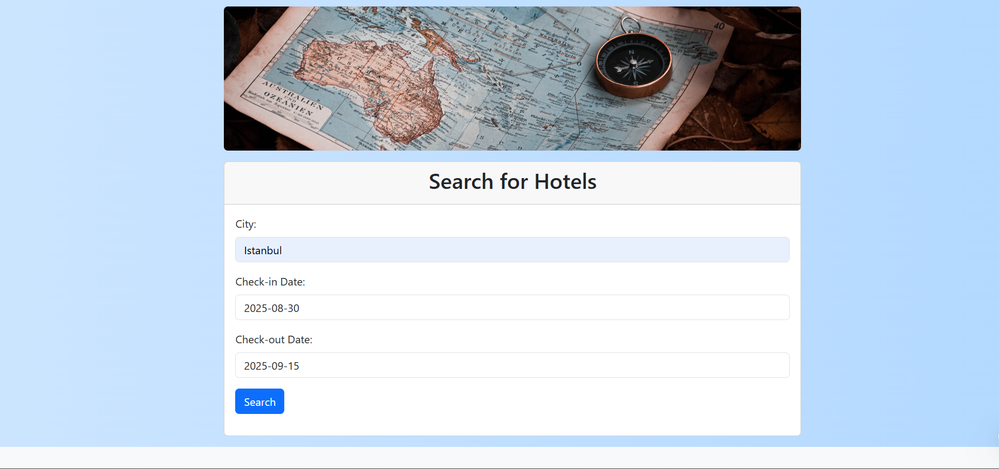

# StayEase – HotelBookingApp

`StayEase` is a modern web application designed to simplify hotel reservations for customers and hotel managers. Built with Java & Spring Boot in the backend and Thymeleaf in the frontend, it follows the MVC architecture for a clean and maintainable design.

## Features

- **User Registration & Management**: Users can register, login, and manage profiles with strong password and form validations.
- **Hotel Management**: Hotel managers can add/edit hotels, set room availability, prices, and details.
- **Hotel Search**: Search hotels by city (Berlin, Istanbul) and check-in/check-out dates.
- **Hotel Listing**: Displays a list of available hotels with relevant details such as name, available room counts, and prices.
- **Hotel Details**: Provides in-depth information on hotels, including name, address, room availability, pricing, and an interactive map leveraging the Nominatim geocoding API and Leaflet library.
- **Room Booking**: Customers can select the desired number of rooms and get redirected to payment for finalizing the reservation.
- **Payment Portal**: Secure credit card payment with validations like Luhn checks and custom validators for expiry dates and CVV. (No third-party payment gateways are implemented.)
- **Booking Management**: Customers and hotel managers can view their bookings through the dashboard.
- **Admin Panel**: Allows administrators to manage users, hotels, rooms, and bookings.
- **Responsive Design**: The app is optimized for various devices including desktops, tablets, and smartphones.

## Technology Stack

- **Backend**:
  - Java 17
  - Spring Boot 3.1.1
  - MVC Architecture (Spring Web MVC 6.0.10)
- **Frontend**:
  - Thymeleaf 3.1.1
  - Bootstrap 5.3.0
  - Bootstrap Icons 1.10.5
  - jQuery 3.7.0
  - jQuery-UI 1.13.2
  - Leaflet 1.9.4 (interactive maps)
- **Database**:
  - MySQL
- **Security**:
  - Spring Security 6.1.1 (authentication and authorization)
- **Other Tools**:
  - Lombok (boilerplate code reduction)
  - Thymeleaf extras and layout dialect (enhanced UI functionality)

## Prerequisites

- Java JDK 17
- Maven
- MySQL

## Installation & Running

1. Clone the repository:
```bash
   git clone https://github.com/Shraddhaab12/stayease-hotel-booking.git

   ```
   
2. Navigate to the project directory::
   ```bash
   cd stayease-hotel-booking
   ```
   
3. Install the dependencies::
   ```bash
   mvn install
   ```
   
4. Update application.properties with your MySQL database configurations.
   
6. Run the application:
   ```bash
   mvn spring-boot:run
   ```
   
7. Access the application via your browser at http://localhost:8080/.

## Screenshots

- **Home Page**
  

- **Login Page**
  

- **Register Page**
  

- **Search Page**
  

- **Results Page**
  

- **Hotel_D Page**
  

- **Payment Page**
  

- **Booking Page**
  


